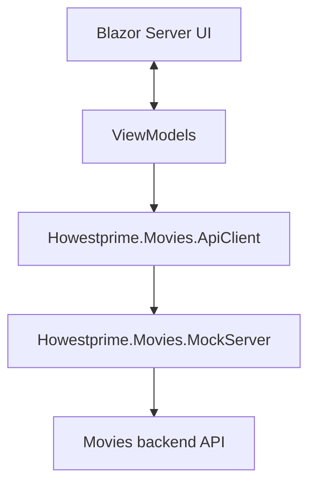

<div align="center">

# 🎬 HowestPrime Backoffice

**A staff-facing cinema admin app built with .NET 10 and Blazor Server for catalog management and screening planning.**

<p>
  
  
  
  
  
  
</p>

</div>

> Built for the staff workflow around the HowestPrime movie platform.

## 📑 Table of Contents

- [📖 About](#about)
- [🏗️ Architecture](#architecture)
- [✨ Features](#features)
- [📱 Screens](#screens)
- [🛠️ Tech Stack](#tech-stack)
- [🚀 Getting Started](#getting-started)
- [📄 License](#license)
- [👤 Author](#author)

## 📖 About

- This repository contains the internal admin application for the HowestPrime movie platform.
- It is used by staff to manage the movie catalog and plan screenings across rooms.
- The app uses a typed movie API client and a local mock server for development.
- Configuration is externalized through `appsettings.json` and environment-specific files.

## 🏗️ Architecture



## ✨ Features

**🎞️ Movie catalog**

- Register new movies.
- View metadata such as title, release year, genres, actors, duration, and age rating.
- Inspect poster links and other movie details.

**📅 Planning**

- Schedule screenings for rooms.
- Review room conflicts before saving changes.
- Work with a month-based planning calendar.

**🧪 API validation**

- Use the local mock server during development.
- Validate the app against API-driven business rules.
- Keep the backoffice usable without depending on a live backend.

## 📱 Screens

| Area | Screens |
| --- | --- |
| Main areas | Movies, planning, movie details |
| Management | Create movie, edit movie, schedule screening |
| Support | API configuration, mock-backed validation |

## 🛠️ Tech Stack

| Area | Technologies |
| --- | --- |
| Language | C# |
| UI | Blazor Server |
| Platform | .NET 10, ASP.NET Core |
| Integration | Typed API client |
| Local development | Mock server |
| Build | .NET SDK |

## 🚀 Getting Started

### Prerequisites

- .NET 10 SDK
- A browser
- A terminal

### Restore dependencies

```bash
dotnet restore
```

### Start the mock API server

```bash
dotnet run --project Howestprime.Movies.MockServer
```

The mock server listens on `http://localhost:8000`.

### Start the backoffice app

```bash
dotnet run --project Howestprime.Backoffice
```

The app is typically available at:

- `https://localhost:7155`
- `http://localhost:5243`

### Configuration

The app expects the `MoviesApi` section in `appsettings.json` to point at the movie backend or mock server.

```json
{
  "MoviesApi": {
    "BaseUrl": "http://localhost:8000/",
    "TimeoutSeconds": 30
  }
}
```

## 📄 License

This project uses the Apache 2.0 License

## 👤 Author

| Name | GitHub | LinkedIn |
| --- | --- | --- |
| Maurice De Kegel | [MriceDK](https://github.com/MriceDK) | [LinkedIn](https://www.linkedin.com/in/dekegelmaurice/) |
